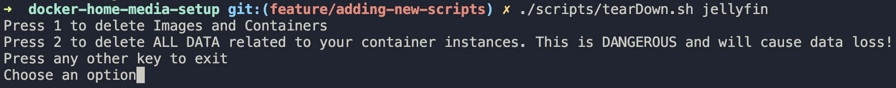
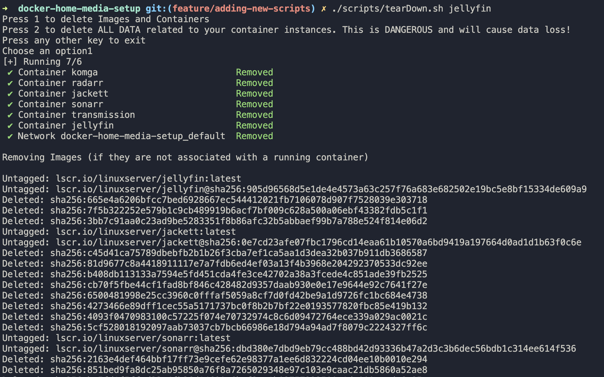
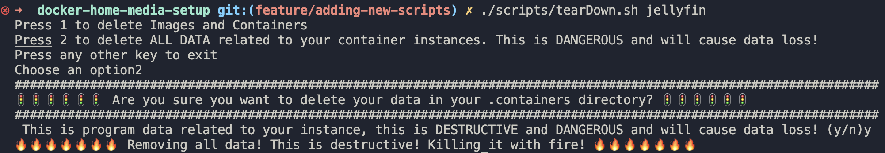
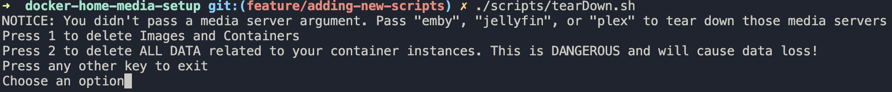
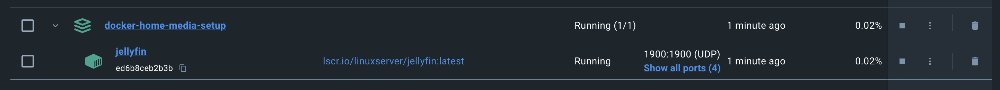

# Helper Scripts

## Command Line Arguments

<table>
<thead>
    <th colspan="2">Media Server Arguments</td>
</thead>
<thead>
    <th>Options</th>
    <th>Description</th>
</thead>
  <tr>
    <td></td>
    <td>Starts all containers without a media server.</td>
  </tr>
  <tr>
    <td><code>emby</code></td>
    <td>Starts all containers with Emby as the Media Server</td>
  </tr>
  <tr>
    <td><code>jellyfin</code></td>
    <td>Starts all containers with Jellyfin as the Media Server</td>
  </tr>
  <tr>
    <td><code>plex</code></td>
    <td>Starts all containers with Plex as the Media Server</td>
  </tr>
</table>

<table>
<thead>
    <th colspan="2">Home Automation Arguments</td>
</thead>
<thead>
    <th>Options</th>
    <th>Description</th>
</thead>
  <tr>
    <td><code>hassio</code></td>
    <td>Starts Home Assistant, ZWaveJS, and Portainer. <br/>
    This is not a <code>--profile</code>, just part of the <code>startup.sh</code> script
    </td>
  </tr>
</table>

### `startup.sh`

- This is just a useful script to startup your server without needing to know the docker compose commands.
- Takes in an optional `$arg` to startup the media server with your server

#### Example: Start with Jellyfin

```sh
./scripts/startup.sh jellyfin
```

#### Example: Start with No Media Server

```sh
./scripts/startup.sh
```

### `tearDown.sh`

- This is a potentially destructive script. Be very careful using this. **Use it at your own risk!**
- This script also takes in a `$arg` for media server (see table above for options).
- There are 2 options when running this script:
  - Option 1:
    - The script will attempt to shutdown all running containers.
    - It will remove all docker images (as long as the container is shut down).
  - Option 2:
    - 🔥🔥🔥🔥🔥🔥🔥 **DANGER AHEAD** 🔥🔥🔥🔥🔥🔥🔥
    - This will destroy the `./.containers` directory and remove any data from the machine related to your container instances.
    - This command should be a no-op as you _will_ need to set everything back up from scratch by rerunning the `startup.sh` script.
      - This is useful if you have data corruption and need to start fresh. I would recommend backing up your entire `./.containers/` directory prior to running this command.

#### Examples

##### With Media Server Argument





##### Without Media Server Argument




_Looks like it is telling us that a container was being used by a running service_



_Notice that Jellyfin is still running_


